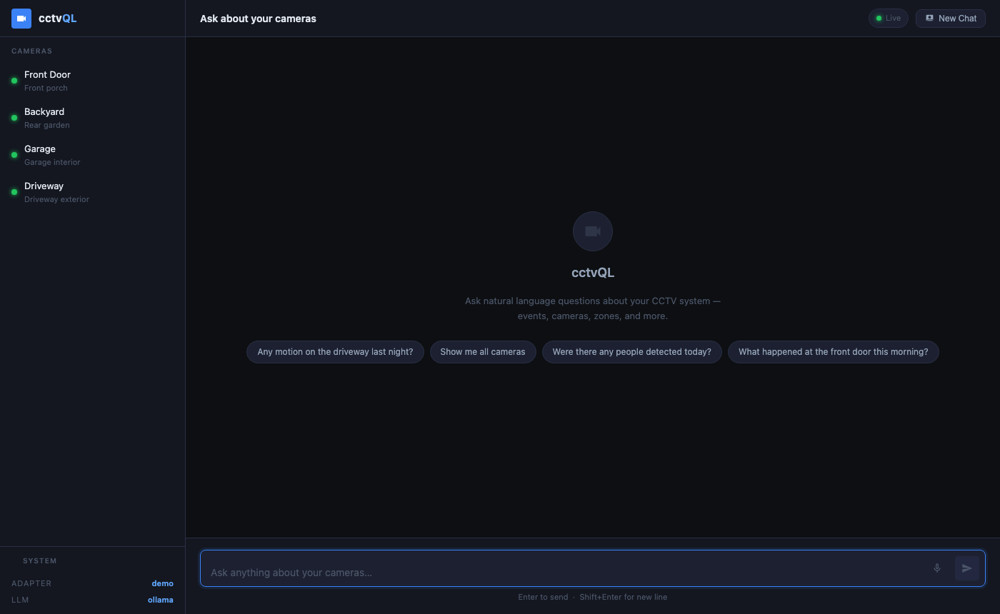
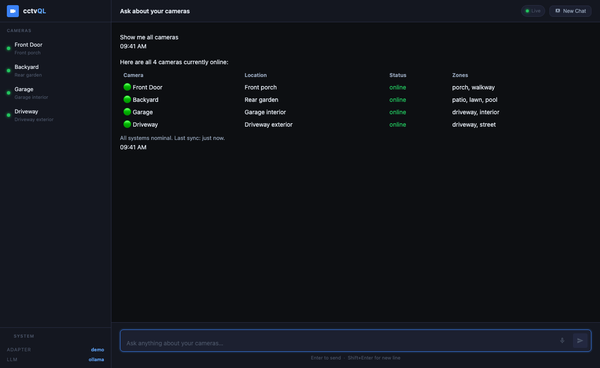
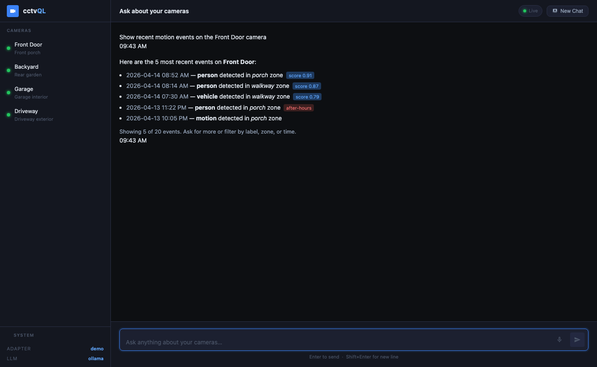
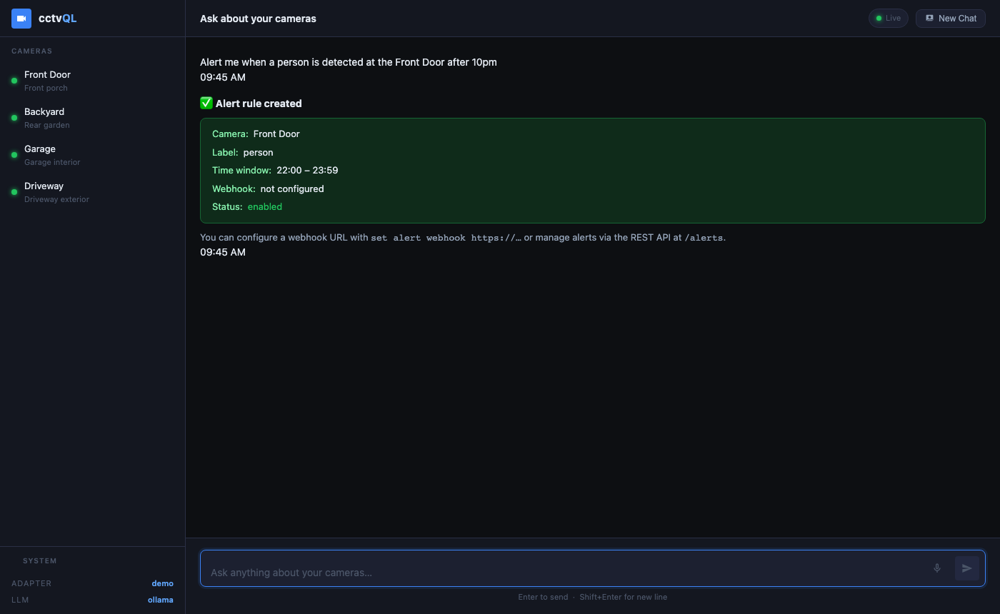
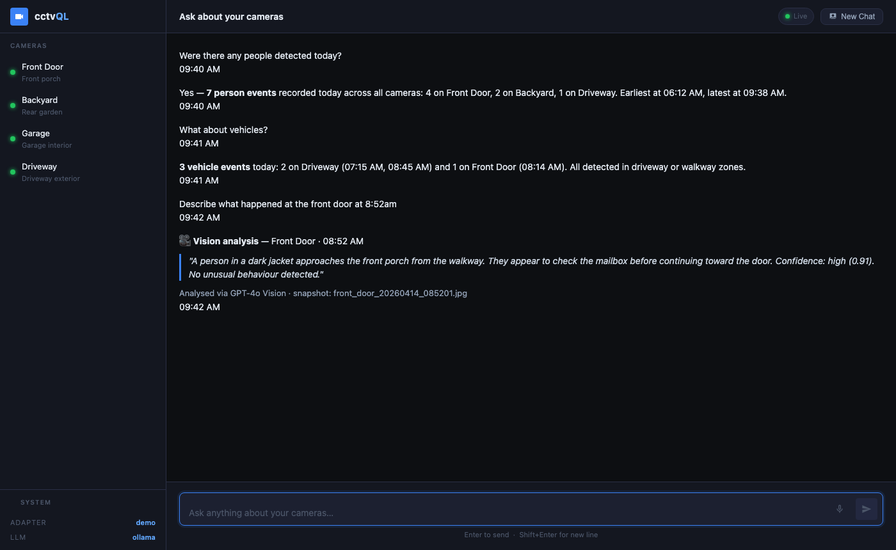

<div align="center">

# cctvQL

**Ask your CCTV system anything in plain English.**

[](LICENSE)
[](https://python.org)
[](https://github.com/arunrajiah/cctvql/actions)
[](https://github.com/arunrajiah/cctvql/actions)
[](https://pypi.org/project/cctvql/)
[](https://hub.docker.com/r/arunrajiah/cctvql)
[](CONTRIBUTING.md)
[](https://github.com/arunrajiah/cctvql/actions/workflows/codeql.yml)

cctvQL is an open-source **conversational query layer** for CCTV and surveillance systems.
It wraps any camera system — Frigate, ONVIF, Hikvision, Dahua and more — with a natural language interface powered by local or cloud LLMs.

[Quick Start](#quick-start) · [Documentation](#documentation) · [Adapters](#supported-systems) · [Contributing](#contributing)

</div>

---

## What It Does

```
you      > Was there anyone near the front door last night?

cctvQL   > Yes — 3 person detections on "Front Door" between 22:14 and 23:47.
           • 22:14 — person (96%) in zone: driveway
           • 23:02 — person (88%)
           • 23:47 — person (91%) in zone: porch

you      > Show me the clip from 23:47

cctvQL   > Clip from Front Door (23:47–23:49, 112s):
           http://192.168.1.100:5000/api/events/abc123/clip.mp4
```

No dashboards. No complex queries. Just ask.

---

## Features

- **Natural language queries** — ask about events, cameras, clips, and system health in plain English
- **Multi-turn conversations** — context-aware follow-up questions work naturally
- **Vendor-agnostic** — adapter pattern supports any CCTV system; ships with Frigate + ONVIF
- **Pluggable LLM backends** — Ollama (local/private), OpenAI, Anthropic, or any OpenAI-compatible API
- **REST API** — integrate with Home Assistant, Grafana, custom dashboards, or mobile apps
- **WebSocket streaming** — real-time event push to any connected client via `ws://host/ws/events`
- **Prometheus metrics** — `/metrics` endpoint for Grafana, alerting, and observability
- **Optional API key auth** — protect your endpoint with `CCTVQL_API_KEY` env var
- **Demo adapter** — try cctvQL without any hardware; realistic mock data built-in
- **Interactive CLI** — terminal-based conversational REPL
- **Real-time events** — MQTT subscription for live alerts (Frigate)
- **Docker-ready** — running in under 5 minutes

---

## Screenshots

<div align="center">

**Web UI — landing**


**Camera list query**


**Event history**


**Alert rule creation**


**Multi-turn conversation with vision AI**


</div>

---

## Quick Start

### Try it now — no hardware needed

```bash
pip install cctvql
cctvql chat --adapter demo --llm ollama
```

The demo adapter ships with 4 cameras, 20 realistic events, and 5 clips — no Frigate or ONVIF device required. Use it to explore the query interface, build integrations, or write tests.

### Docker (recommended — 5 minutes)

```bash
# 1. Clone and configure
git clone https://github.com/arunrajiah/cctvql.git
cd cctvql
cp config/example.yaml config/config.yaml

# 2. Edit config/config.yaml with your Frigate URL and LLM settings
nano config/config.yaml

# 3. Start
docker compose up -d

# 4. Try it
curl -X POST http://localhost:8000/query \
  -H "Content-Type: application/json" \
  -d '{"query": "Show me all cameras"}'
```

API docs: `http://localhost:8000/docs`

### pip

```bash
pip install cctvql

# Interactive chat
cctvql chat --config config/config.yaml

# REST API server
cctvql serve --config config/config.yaml --port 8000
```

### From source

```bash
git clone https://github.com/arunrajiah/cctvql.git
cd cctvql
pip install -e ".[dev,mqtt,onvif]"
cctvql chat
```

---

## Documentation

| Topic | Link |
|-------|-------|
| Configuration reference | [docs/configuration.md](docs/configuration.md) |
| REST API reference | [docs/api.md](docs/api.md) |
| Writing an adapter | [docs/adapters.md](docs/adapters.md) |
| LLM backend setup | [docs/llm-backends.md](docs/llm-backends.md) |
| Home Assistant integration | [docs/home-assistant.md](docs/home-assistant.md) |
| Docker deployment | [docs/docker.md](docs/docker.md) |
| Troubleshooting | [docs/troubleshooting.md](docs/troubleshooting.md) |

---

## Supported Systems

| System | Type | Adapter | Status |
|--------|------|---------|--------|
| [Frigate NVR](https://frigate.video) | NVR | `frigate` | ✅ Full support (REST + MQTT) |
| Any ONVIF camera/NVR | Camera/NVR | `onvif` | ✅ Full support |
| Demo / Mock | Built-in | `demo` | ✅ No hardware needed — try cctvQL now |
| Hikvision | NVR/Camera | `hikvision` | 🚧 Planned — [help wanted](https://github.com/arunrajiah/cctvql/issues) |
| Dahua | NVR/Camera | `dahua` | 🚧 Planned — [help wanted](https://github.com/arunrajiah/cctvql/issues) |
| Synology Surveillance Station | NVR | `synology` | 🚧 Planned |
| Milestone XProtect | Enterprise NVR | `milestone` | 🚧 Planned |
| Scrypted | Smart home NVR | `scrypted` | 🚧 Planned |
| **Your system** | Any | — | [Write an adapter!](docs/adapters.md) |

> Writing an adapter takes ~100 lines. See the [adapter guide](docs/adapters.md).

---

## Supported LLM Backends

| Backend | Privacy | Cost | Quality |
|---------|---------|------|---------|
| [Ollama](https://ollama.com) (llama3, mistral, phi3…) | 🔒 100% local | Free | ⭐⭐⭐⭐ |
| OpenAI (gpt-4o-mini, gpt-4o) | ☁️ Cloud | Paid | ⭐⭐⭐⭐⭐ |
| Anthropic (claude-haiku, claude-sonnet) | ☁️ Cloud | Paid | ⭐⭐⭐⭐⭐ |
| [LM Studio](https://lmstudio.ai) | 🔒 Local | Free | ⭐⭐⭐⭐ |
| Any OpenAI-compatible API | Varies | Varies | Varies |

**Recommended for privacy:** Ollama with `llama3` or `mistral`. No data leaves your network.

---

## Configuration

```yaml
# config/config.yaml
llm:
  active: ollama
  backends:
    ollama:
      provider: ollama
      host: http://localhost:11434
      model: llama3

adapters:
  active: frigate
  systems:
    frigate:
      type: frigate
      host: http://192.168.1.100:5000
      mqtt_host: 192.168.1.100      # optional, for real-time events
```

See [docs/configuration.md](docs/configuration.md) for the full reference.

---

## REST API

```bash
# Natural language query (supports multi-turn sessions)
POST /query
{"query": "Did anyone come to the front door after midnight?", "session_id": "my-session"}

# List cameras
GET /cameras

# Get events with filters
GET /events?camera=driveway&label=person&after=1712000000&limit=10

# System health
GET /health

# Prometheus metrics (for Grafana / alerting)
GET /metrics

# Clear conversation session
DELETE /sessions/{session_id}
```

Real-time event streaming via WebSocket:
```
ws://localhost:8000/ws/events
```

Optional API key auth — set `CCTVQL_API_KEY` env var to require `X-API-Key` header on all requests.

Interactive Swagger docs available at `http://localhost:8000/docs`.

---

## Architecture

```
┌─────────────────────────────────────────────────────────┐
│                    User Interface                        │
│         CLI Chat  │  REST API  │  Home Assistant         │
└─────────────────────────┬───────────────────────────────┘
                          │
┌─────────────────────────▼───────────────────────────────┐
│                    NLP Engine                            │
│   Natural Language → QueryContext (intent + params)      │
└─────────────────────────┬───────────────────────────────┘
                          │
           ┌──────────────▼──────────────┐
           │        LLM Registry         │
           │  Ollama │ OpenAI │ Anthropic │
           └──────────────┬──────────────┘
                          │
┌─────────────────────────▼───────────────────────────────┐
│                   Query Router                           │
│   Routes intent to adapter → formats human response     │
└─────────────────────────┬───────────────────────────────┘
                          │
           ┌──────────────▼──────────────┐
           │      Adapter Registry       │
           │  Frigate │ ONVIF │ Your NVR │
           └──────────────┬──────────────┘
                          │
┌─────────────────────────▼───────────────────────────────┐
│                  Your CCTV System                        │
│         NVR / IP Cameras / Recording Storage             │
└─────────────────────────────────────────────────────────┘
```

---

## Project Structure

```
cctvql/
├── cctvql/
│   ├── core/
│   │   ├── schema.py          # Vendor-agnostic data models
│   │   ├── nlp_engine.py      # Natural language → QueryContext
│   │   └── query_router.py    # QueryContext → adapter → response
│   ├── adapters/
│   │   ├── base.py            # BaseAdapter interface (implement to add a system)
│   │   ├── frigate.py         # Frigate NVR (REST + MQTT)
│   │   └── onvif.py           # Generic ONVIF adapter
│   ├── llm/
│   │   ├── base.py            # BaseLLM interface + LLMRegistry
│   │   ├── ollama_backend.py  # Local LLM via Ollama
│   │   ├── openai_backend.py  # OpenAI / compatible APIs
│   │   └── anthropic_backend.py
│   ├── interfaces/
│   │   ├── cli.py             # Interactive terminal chat
│   │   └── rest_api.py        # FastAPI REST server
│   ├── _bootstrap.py          # Config loader and wiring
│   └── __main__.py            # Entry point (cctvql chat / serve)
├── config/
│   └── example.yaml           # Annotated config reference
├── docs/                      # Full documentation
├── tests/
├── Dockerfile
├── docker-compose.yml
└── pyproject.toml
```

---

## Contributing

Contributions are what make cctvQL useful for everyone. The single highest-impact contribution is **writing an adapter** for a CCTV system you already have.

```bash
git clone https://github.com/arunrajiah/cctvql.git
cd cctvql
pip install -e ".[dev,mqtt,onvif]"
pytest tests/   # all tests should pass
```

See [CONTRIBUTING.md](CONTRIBUTING.md) for the full guide.

```bash
# Common developer commands
make dev          # install with all extras + pre-commit hooks
make test         # run test suite
make coverage     # tests + coverage report
make lint         # ruff linter
make type-check   # mypy
make demo         # interactive demo (no real hardware needed)
```

**Most wanted contributions:**
- Hikvision adapter
- Dahua adapter
- Synology Surveillance Station adapter
- Vision-based event description (send snapshot to LLM)
- Home Assistant custom integration

---

## FAQ

**Does my camera data leave my network?**
Only if you use a cloud LLM backend (OpenAI, Anthropic). With Ollama, everything — including the AI processing — stays on your local machine.

**Which Frigate version is supported?**
Frigate 0.12+ is tested. Most features work with 0.9+.

**Can I use this with any ONVIF camera?**
Yes. ONVIF Profile S is supported for live streaming and snapshots. Profile G adds recording/clip support.

**Can I query multiple camera systems at once?**
Yes — use `"multi": true` in your query request to fan out across all registered adapters simultaneously.

**Is there a Home Assistant integration?**
A native Home Assistant custom integration is planned. For now, use the REST API endpoint from HA automations.

---

## Roadmap

- [x] Vision analysis — pass event snapshots to multimodal LLMs for rich descriptions
- [x] Hikvision adapter
- [x] Dahua adapter
- [x] Web UI (lightweight chat interface)
- [x] Multi-system queries (query across multiple NVRs simultaneously)
- [x] Alert rules via natural language ("notify me when a person enters Zone A after 10pm")
- [x] Voice interface (Whisper STT + TTS output)
- [ ] Home Assistant custom integration
- [ ] ONVIF discovery — auto-detect cameras on the local network
- [ ] Event timeline UI — visual timeline of events across all cameras
- [ ] Face recognition — identify known individuals across camera feeds
- [ ] Anomaly detection — flag unusual activity patterns automatically
- [ ] Multi-tenant support — per-user camera permissions and isolated sessions
- [ ] Mobile app (React Native)

---

## License

MIT © 2026 [arunrajiah](https://github.com/arunrajiah)

See [LICENSE](LICENSE) for the full text.

---

<div align="center">
If cctvQL is useful to you, please ⭐ the repo — it helps others find it!
</div>
